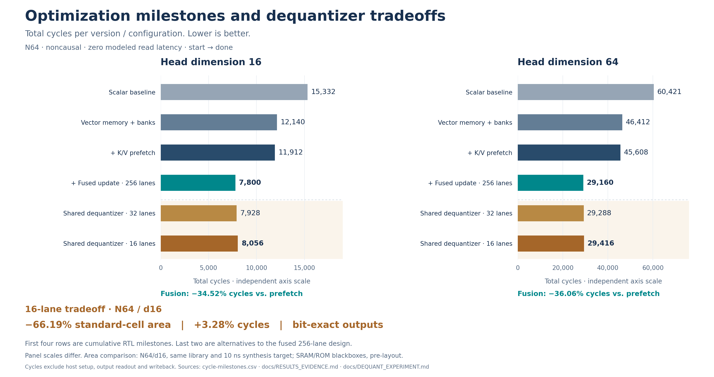

# FlashAttention Hardware Accelerator

[](https://github.com/szuwei-yeh/flashattn-accelerator/actions/workflows/ci.yml)

**Tiled INT8 attention in SystemVerilog — from AXI reads to normalized output.**

One shared **16 × 16 systolic array** performs QKᵀ and PV, while **16 online-softmax
lanes** carry state across tiles. Vector DMA, banked scratchpads, K/V prefetch,
and fused output updates reduce data movement without writing the full attention
matrix to external memory. The optimized path supports **single-head prefill at
N64, d16/d64**, with causal and noncausal attention.

The latest matched synthesis experiment reduces integrated-top **standard-cell
area by 66.19% for 3.28% more cycles** at N64/d16 by sharing 16 dequantizers,
**compared with the 256-lane baseline**.
All three lane configurations preserve exact fixed-point outputs in the recorded
**624-transaction RTL sweep**.

[Design](docs/DESIGN.md) · [Measured results](#measured-results) ·
[Quick start](#quick-start) · [Verification](docs/VERIFICATION.md) ·
[Documentation index](docs/README.md)

## Architecture


- **Data movement:** 64-bit AXI reads fill 16-bank Q/K/V scratchpads. DMA and local K/V shadow-tile prefetch overlap compute after the first tile pair is resident.
- **Shared compute:** the same array performs QKᵀ and PV with INT8 operands and INT32 accumulation. d64 uses four chunks on the array.
- **Online attention:** score tiles feed 16 softmax lanes; running maxima and sums carry across tiles. Output rescaling and accumulation share one buffer traversal, followed by final normalization.
- **Configurable dequantization:** `DEQUANT_LANES=256` retains the parallel baseline; 32 or 16 lanes assemble each 256-score tile in batches before softmax consumes it.

The AXI memory model and testbench are outside the synthesizable DUT. Results
are read through the output port after `done`; the main path has no AXI writeback.
See the [design guide](docs/DESIGN.md) for arithmetic, tile ownership and interlocks.

## Measured results

The three DMA-integrated tops below use the same measured RTL source
(`d5f9123`; [equivalent current revision](docs/README.md#october-3-revision-identities)), library,
constraints and synthesis flow: **Design Compiler R-2020.09-SP4, typical
`gscl45nm.db`, a 10 ns clock, 1 ns I/O delays and ordinary `compile`**.

| Dequantizer lanes | Standard-cell area¹ | Area reduction | d16 top cycles² | Setup slack |
|---|---:|---:|---:|---:|
| 256 (default) | 5,074,665.315 | — | 7,800 | +3.92 ns |
| 32 | 1,940,361.688 | 61.76% | 7,928 (+1.64%) | +0.66 ns |
| 16 | 1,715,678.209 | **66.19%** | 8,056 (+3.28%) | +2.12 ns |

¹ Area is in library units. SRAM/ROM are logical blackboxes; physical memory
area and access timing are excluded. This is pre-layout synthesis, without
physical or electrical signoff. All three runs have zero setup TNS and zero
setup violating paths under these constraints.

² Cycles are noncausal N64/d16 testbench `start → done` at zero modeled read
latency, excluding host initialization and output readout. At d64, the corresponding
counts are **29,160 / 29,288 / 29,416**; d64 is functionally verified, but this
synthesis comparison is **d16 only**. The default remains 256 lanes.

[Experiment and reproduction](docs/DEQUANT_EXPERIMENT.md) ·
[Source and report provenance](docs/evidence/2026-10-03/provenance.json) ·
[Complete cycle counts](docs/analysis/2026-10-03/cycles.csv) ·
[Warnings and measurement limits](docs/RESULTS_EVIDENCE.md)

The additional **workload activity estimate** for canonical noncausal N64/d16
is **9.926 / 8.352 / 8.301 µJ per job** for 256 / 32 / 16 lanes at 100 MHz.
The 16-lane estimate is **16.36% lower** than the 256-lane baseline; this is
pre-layout standard-cell power with partial RTL activity and logical memory
blackboxes. [Four workloads, annotation quality and limits](docs/COVERAGE_POWER.md#workload-based-standard-cell-power-estimates)
separate these results from the earlier vectorless DC estimate.

## Verification

| Layer | Recorded checks |
|---|---|
| Exact end-to-end RTL | **312 invocations / 624 transactions** across 256/32/16 lanes, d16/d64, causal/noncausal and top read latencies 0/20/100 |
| Main-path four-state coverage | **90 VCS invocations / 186 exact transactions**; DUT line 96.97–97.64%, branch 96.17–97.79%; all defined functional bins hit |
| Arithmetic and state | Full default regression; signed-scale and saturation corner cases; 200 shared-score tiles per 16/32-lane variant; four-state initialization and partial-tile reset checks |
| AXI and control | Backpressure, burst boundaries, response errors, address guards, accepted-configuration locking, busy-start rejection and common-reset recovery |
| Bounded formal | Controller safety to depth 48 and reachability covers, with an abstracted datapath |
| Numerical quality | **52 cases** comparing fixed-point arithmetic with float64 attention on the same quantized inputs, including saturation and precision limits |
| GitHub Actions | Python checks, all six lane/dimension smoke configurations, and selected AXI/control/arithmetic/four-state checks |

Exact fixed-point agreement does not establish floating-point equivalence or
model accuracy. The [numerical report](docs/NUMERICAL_ACCURACY.md) publishes both
ordinary fixtures and adversarial saturation cases. Formal checks cover bounded
controller behavior, and CI runs a subset of the full verification suite.

The optimized interface accepts **one transaction per common reset**. Multihead,
GQA, decode and AXI writeback are outside this verified main path.

[Four-state coverage and gaps](docs/COVERAGE_POWER.md) ·
[Verification contracts and commands](docs/VERIFICATION.md) ·
[Recorded RTL sweep](docs/analysis/2026-10-03/verification.json) ·
[Live CI runs](https://github.com/szuwei-yeh/flashattn-accelerator/actions)

## Quick start

Use **Verilator 5.046**, a C++ compiler, and Python 3 with NumPy. The checkout
path must **not contain spaces**. CI builds and caches the pinned simulator.
From the repository root:

```bash
# Default 256-lane N64/d16 DMA top; canonical zero-latency count: 7,800 cycles.
make -C sim/verilator dma_banked_prefetch_top_N64

# 16-lane core/top smoke: causal + noncausal, top read latencies 0/20/100.
python3 sim/verilator/run_dequant_sweep.py --lanes 16 --dim 16 --smoke
```

Use `--lanes 32` or `256` and `--dim 64` to select other configurations. Omit
`--smoke` to include the generated numerical-analysis fixtures. For the full
default regression:

```bash
make -C sim/verilator regression
```

The [verification guide](docs/VERIFICATION.md#reproducing-checks) includes
additional audits, four-state simulation and formal requirements. Reproducing
mapped synthesis requires licensed Synopsys tools and the specified library;
follow the [synthesis guide](syn/README.md).

## Earlier optimization milestones



| Optimization | Improvement | Test conditions / baseline |
|---|---|---|
| Vector DMA | **312 → 56 cycles (5.57× faster fill)** | 256 B, scalar → vector DMA, modeled read latency 10 |
| Banked scratchpad | **256 → 17 cycles (15.06× faster drain)** | 256 B, byte-serial → 16-bank stripe read |
| Vector DMA + banked memory | **1.26× / 1.30× E2E speedup** | N64 d16/d64, scalar memory → vector/banked memory |
| K/V prefetch | **1.88% / 1.73% fewer cycles** | N64 d16/d64, vector/banked top → resident-tile prefetch top |
| Fused output update | **34.52% / 36.06% fewer cycles** | N64 d16/d64, unfused → fused prefetch top |
| Shared Q/K scale | **7.35% less core cell area** | N64/d16, per-lane → shared scale product, identical synthesis library/constraints |

E2E rows use noncausal testbench `start → done` at zero modeled read latency,
excluding host setup and output readout. Each comparison uses its own baseline;
the improvements are not additive. Source revisions and report definitions are
preserved in the [results evidence](docs/RESULTS_EVIDENCE.md). The latest
256/32/16-lane dequantizer sweep is a separate matched experiment.

## Repository guide

| Directory | Contents |
|---|---|
| `rtl/` | Compute, control, memory, DMA and arithmetic blocks; optimized entry point: [DMA-prefetch top](rtl/top/flash_attn_top_dma_banked_prefetch.sv) |
| `sim/verilator/` | RTL testbenches, regression targets and lane/dimension sweep runner |
| `sim/icarus/` | Four-state output-buffer and shared-score initialization tests |
| `formal/` | Bounded controller safety and reachability checks |
| `golden/` | Fixed-point reference, fixture generators and numerical analysis |
| `data/` | Versioned inputs, expected outputs, scales and exponential LUT |
| `syn/` | Synthesis scripts, filelists and logical memory blackboxes |
| `docs/` | [Documentation index](docs/README.md), design, verification and preserved measurement evidence |
