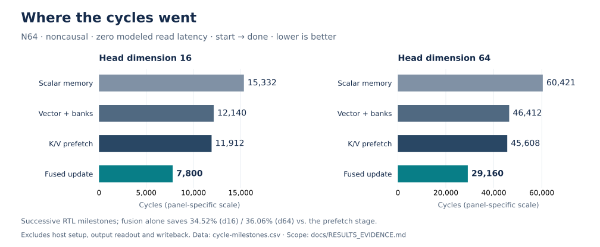

# FlashAttention Hardware Accelerator

**Tiled INT8 attention in SystemVerilog — from AXI reads to normalized output.**

One shared **16 × 16 systolic array** performs QKᵀ and PV; **16 online-softmax
lanes** carry state across tiles. Vector DMA, banked scratchpads, K/V prefetch,
and fused output updates reduce data movement without storing the full attention
matrix in DRAM. The main portfolio path is **single-head prefill**, verified at
N64 with head dimensions 16 and 64.

[Architecture](docs/DESIGN.md) · [Results & evidence](docs/RESULTS_EVIDENCE.md) ·
[Verification](docs/VERIFICATION.md) · [Run a simulation](#quick-start) ·
[Synthesis flow](syn/README.md)

| Result | What it demonstrates |
|---|---|
| **7,800 / 29,160 cycles** at N64 d16 / d64 | Current DMA-prefetch top, testbench start → done, zero modeled read latency |
| **34.52% / 36.06% fewer cycles** | Fused output update vs the historical unfused prefetch top |
| **+3.94 ns setup slack** at a 10 ns target | Current N64/d16 integrated top, pre-layout Design Compiler mapping |
| **7.35% lower cell area** | Historical matched N64/d16 shared-Q/K-scale experiment |

Timing uses logical memory blackboxes; this is **not physical signoff**.
Cycle counts exclude host setup, output readout and AXI writeback. Each
optimization comparison below names its own baseline.

## Architecture at a glance


[Architecture details and simulation boundary](docs/DESIGN.md#detailed-architecture-and-simulation-boundary)
explains the behavioral AXI memory and active/shadow tile paths.

DMA fills Q, then K/V tile pairs. Compute begins when the first pair is resident;
subsequent transfers and local shadow-tile prefetch overlap compute. One array
is reused for QKᵀ and PV. The output path fuses rescaling and accumulation into
one buffer traversal per tile/chunk, then normalizes using the running sum.

The **256 dequantizers remain**. The removed logic was an unused normalized
softmax divider path. See the [design guide](docs/DESIGN.md)
for arithmetic, ownership/interlocks and supported configurations.

## Measured optimization milestones



| Optimization | Before | After | Configuration / definition |
|---|---:|---:|---|
| DMA fill | 312 cycles | **56 cycles (5.57×)** | 256 B, scalar vs vector DMA, modeled read latency 10 |
| Scratchpad drain | 256 cycles | **17 cycles (15.06×)** | 256 B, byte-serial vs 16-bank stripe read |
| Memory-path E2E | 15,332 / 60,421 | **12,140 / 46,412** | N64, d16/d64, flat/byte DMA vs banked/vector DMA; 1.263× / 1.302× |
| Incremental K/V prefetch | 12,140 / 46,412 | **11,912 / 45,608** | Same historical memory stage; −1.878% / −1.732% |
| Fused output update | 11,912 / 45,608 | **7,800 / 29,160** | N64, d16/d64 prefetch top; −34.52% / −36.06% |
| Shared Q/K scale | 5,463,487.889 area units | **5,061,648.810 (−7.35%)** | Historical N64/d16 core, identical library/constraints |
| Final DMA-integrated timing | 10 ns target | **+3.94 ns setup slack** | Final N64/d16, `dfbd28e`; mapped DC, memory blackboxes |

E2E counts are testbench `start → done`, with zero modeled read latency unless
stated otherwise. They exclude host initialization, output readout, and AXI
writeback. Memory, prefetch, and fusion rows belong to successive RTL milestones;
the total fusion gain is not a DMA-only speedup. RTL performance counters begin
one cycle earlier than the testbench count.

Final regression of the guarded RTL preserves the canonical core and full-top
cycle counts. Both **N64/d16** profiles now have matched mapped-synthesis
evidence from clean commit `dfbd28e`. See the public
[results evidence](docs/RESULTS_EVIDENCE.md) for source identity, parameter proof,
report excerpts, metric definitions and the disposition of older claims.

## Final N64/d16 logical-synthesis PPA

Both profiles were mapped from clean commit `dfbd28e` after the DMA
address-range fix, using Design Compiler R-2020.09-SP4, typical `gscl45nm.db`,
10 ns clock, 1 ns input/output delays and the unchanged `compile` flow.
SRAM/ROM remain logical blackboxes. Actual hierarchy and mapped declarations
confirm **SEQ_LEN64 / HEAD_DIM16** in both cores.

| Final mapped result | Standalone core | DMA-integrated top |
|---|---:|---:|
| Standard-cell area (library units) | 5,061,521.160 | 5,074,696.289 |
| Critical path length | 6.01 ns | 5.98 ns |
| Worst setup slack at 100 MHz | +3.90 ns | +3.94 ns |
| Setup TNS / violating paths | 0.00 ns / 0 | 0.00 ns / 0 |

Matched top-minus-core area is **13,175.128 units (0.26030%)**.
This includes mapping-context effects and is not isolated DMA area. The top
critical path starts at `u_core/combined_scale_reg_reg[31]` and ends at `u_core/gen_dequant[251].u_deq/data_out_reg[14]`.
Source manifests, netlist/SDC hashes and report extracts are in
[final provenance](docs/evidence/2026-09-30/provenance.json) and
[results evidence](docs/RESULTS_EVIDENCE.md).

The top reports **107,039 max-capacitance violations**. The
high-precision recheck finds a zero required-capacitance limit on every reported
violation; sampled library output pins have `max_capacitance=0`. This library
constraint issue does not establish physical electrical closure. Memory area
and access timing, placement, CTS, routing and extracted parasitics are absent.
DC vectorless power estimates are retained with their unannotated-activity
warnings; they are not workload or measured system power. No physical signoff
or independently measured Fmax is claimed.

The **7.35% shared-scale area reduction** remains the separate historical
N64/d16 comparison `558f6a2` → `f4bccfa`, 5,463,487.889 → 5,061,648.810.
Its exact reduction is 7.3549917%; this release does not replace either endpoint
or attribute that delta to divider removal. The prior September 24 mapping is
retained as [archival evidence](docs/evidence/2026-09-24/provenance.json).

## Verification evidence

These are recorded results for RTL **`dfbd28e`**, not a live CI status badge.

| Layer | Recorded scope |
|---|---|
| End-to-end RTL | N64 d16/d64, causal and noncausal; DMA read latencies 0/20/100 |
| Independent numerical checks | 40 fixtures, 160 core/top transactions; closed-form and permutation checks |
| Testbench failure detection | 147 deliberately rejected oracle scenarios |
| AXI and control | Backpressure, burst boundaries, bad responses, address guards, configuration locking and reset/restart |
| Four-state simulation | Icarus/VCS output-buffer checks; 8 VCS full-top transactions |
| Bounded formal | Controller safety to depth 48 plus reachability covers; abstracted datapath |

Exact fixed-point agreement does not imply FP32 equivalence. Formal is bounded
controller verification, and the scenario runner does not measure aggregate
code/functional coverage. The optimized interface supports **one transaction per
common reset**, a 4096-byte scratchpad per Q/K/V, and an output read port.
Multihead/GQA/decode and AXI writeback wrappers are separate reference paths.

[Verification contracts and reproduction commands](docs/VERIFICATION.md) ·
[Recorded verification summary](docs/evidence/2026-09-30/verification.txt) ·
[Numerical and configuration limits](docs/DESIGN.md)

## Quick start

Install Verilator, a C++ compiler, and Python 3 with NumPy. From the repository
root, build and run the optimized N64/d16 DMA top:

```bash
make -C sim/verilator dma_banked_prefetch_top_N64
```

For the canonical zero-latency run, the recorded testbench count is **7,800
cycles** (the RTL counter starts one cycle earlier). To run the regression:

```bash
make -C sim/verilator regression
```

See the [full verification guide](docs/VERIFICATION.md#reproducing-checks) for
additional audits, numerical checks, four-state simulation and formal tools.
Synthesis requires licensed Synopsys tools and the specified library; follow
the [synthesis guide](syn/README.md).

## Repository guide

| Directory | Contents |
|---|---|
| `rtl/` | Synthesizable blocks, organized by function; the optimized entry point is `top/flash_attn_top_dma_banked_prefetch.sv` |
| `sim/verilator/` | Simulation testbenches, regression targets, and runner checks |
| `sim/icarus/` | Four-state output-buffer testbench, also used by VCS |
| `formal/` | Bounded controller safety and reachability checks |
| `golden/` | Numerical references, fixture generators, and numerical checks |
| `data/` | Versioned input fixtures, expected outputs, scales, and exponential LUT |
| `syn/` | Synthesis scripts, filelists, and logical memory blackboxes; see the [flow guide](syn/README.md) |
| `docs/` | [Documentation index](docs/README.md), current results and compact evidence; current run series: `evidence/2026-09-30/` |

Generated simulator builds remain in ignored `sim/verilator/obj_*` directories;
raw synthesis runs remain in ignored `syn/runs/`. Start with the
[documentation index](docs/README.md) for current evidence and historical boundaries.

## Source organization

`rtl/core` contains compute variants; `rtl/top` contains integrations;
`rtl/interface` contains DMA/AXI and simulation memory models; `rtl/memory`
contains scratchpads, loaders and output storage; `rtl/systolic`, `rtl/softmax`
and `rtl/quantization` contain arithmetic blocks. `sim`, `formal`, `golden` and
`syn` hold the corresponding checks and flows.
