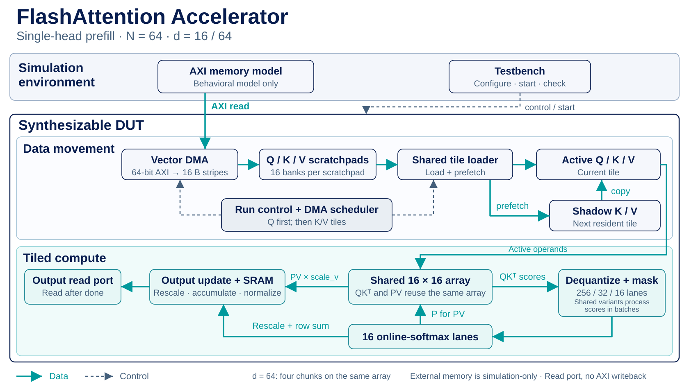

# Design and optimization

[Home](../README.md) · [Verification](VERIFICATION.md) · [Results and evidence](RESULTS_EVIDENCE.md)

This guide describes the optimized single-head DMA/banked/prefetch path.
The current architecture figure follows the measured RTL at `d2bb204`.



The DMA loads Q first, then streams K/V tile pairs. Compute starts once the first
pair is resident; later DMA transfers overlap compute. `kv_tiles_ready` increases
only after both K and V are complete. Prefetch moves an already resident next
K/V tile from scratchpad to shadow registers during processing of the current
tile. Promotion copies shadow to active. A shared-loader interlock prevents
foreground loading from colliding with prefetch.

Each PE has a signed INT32 accumulator. QK uses signed INT8 operands; PV treats
P as unsigned 8-bit and V as signed INT8. For d64, QK retains partial sums across
four 16-element chunks, and PV processes four output-column chunks.

Scales are signed Q8.8. Dequantization preserves the full scale product, rounds,
saturates to INT16, then applies the supported 1/√d shift. Online softmax uses a
running maximum, LUT exponential and running sum. Fused output update preserves
the original 32-bit truncation/wrap semantics; final division truncates toward
zero. Exact fixed-point equality does not imply FP32 attention equality.

The numerical contract includes two deliberate precision limits. The PV operand
caps exp(0) from 256 to 255, while the softmax denominator retains 256: uniform
scores with V=1 and scale_v=256 therefore produce 255/256 (0.390625% low).
Dequantizer saturation occurs before the sqrt(d) shift, so large distinct logits
can become equal; this is not a full-range FP32 softmax. Dequantization rounds
ties toward positive infinity, PV/rescale shifts round down, and final signed
division truncates toward zero.

## Optimization evidence

- Vector writes and conflict-free banked stripe reads eliminated byte-serial
  movement between AXI and compute.
- Prefetch overlaps local tile staging with softmax/PV/output work. Its isolated
  E2E gain is modest because loading is a small part of runtime.
- Fusing rescale and accumulation removes one output-buffer traversal per
  tile/chunk: `16 tile pairs × {1,4} chunks × 257 cycles` matches the measured
  d16/d64 savings.
- Synthesis exposed 256 unused normalized-softmax compatibility dividers.
  Disabling that output path removed the failing divider path while preserving
  the running state and exp weights actually consumed by the core.
- Sharing the Q/K scale product reduced area further. The dequantizers remain
  the largest area contributor, 72.74% of the final measured integrated top.

## Supported configuration and limitations

- Optimized single-head prefill: `TILE_SIZE=16`, `HEAD_DIM` in `{16,64}`.
- Compile-time nonzero tile-aligned `SEQ_LEN`; runtime `cfg_seq_len` must equal it.
- `SRAM_DEPTH=4096` only, with `SEQ_LEN * HEAD_DIM <= 4096`. The optimized
  path uses fixed 12-bit internal interfaces; smaller depths are unsupported
  and rejected by the RTL guards and synthesis parameter validator.
- AXI 32-bit addresses, 64-bit data; Q/K/V bases 16-byte aligned, with each
  complete `SEQ_LEN * HEAD_DIM`-byte matrix fitting below the 2^32-byte limit.
- One shared clock and one outstanding AXI read burst.
- Behavioral external memory models fixed first-beat latency, not a DDR/HBM
  controller, bank scheduling, refresh, response reordering, or physical timing.
- Optimized output is an external read port. The older AXI writeback wrapper
  uses the non-prefetch banked core.
- Broader N/d support, multihead integration, physical memory macros and physical
  implementation are outside the currently validated optimized path.

## Figure sources and regeneration

`figures/architecture.svg` is a simplified logical dataflow, not a complete port
or timing diagram. In particular, individual operand muxes and control wires are
omitted. The array is one physical RTL instance reused for QK and PV.

`figures/cycle-milestones.csv` records the historical cycle-count milestones from
the [results table](../README.md#measured-optimization-milestones). Each bar uses
its actual cycle count; the two dimension panels use different axis ranges.
The final values also match the current guarded RTL regression. These are
successive implementation milestones, not four configurations of the current RTL.

Regenerate the two SVGs from the repository root with Python 3 and Matplotlib:

```bash
python3 docs/figures/render.py
```

